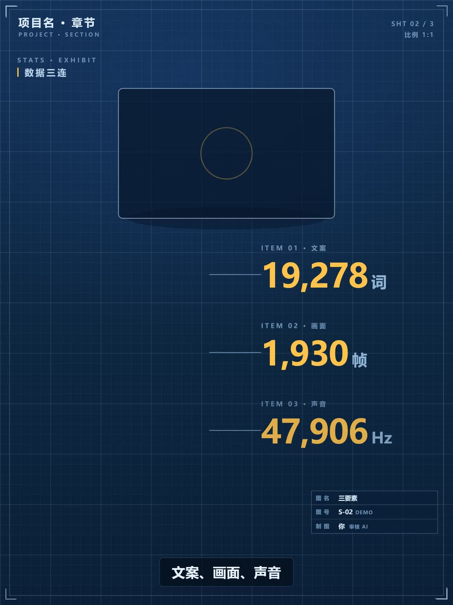
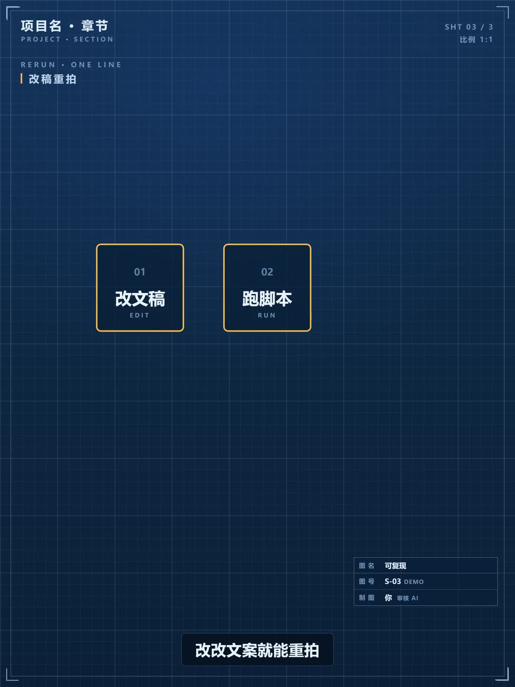
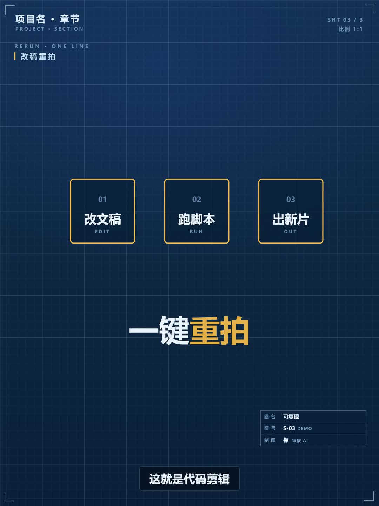

# script-to-video · 文稿 → 竖版科普短视频

**Turn any document into a 3:4 short video — rendered entirely by code.**

把一份文稿（工程纪实 / 报告 / 论文 / 说明书 / 科普资料）变成一条 1080×1440 的
竖版短视频：**没有剪辑软件、没有 AI 视频生成 API、没有素材库**——
动画是单文件 HTML 里的确定性纯函数，Playwright 逐帧截图，ffmpeg 编码合成。
全程本地运行，零成本，逐帧可复现。

This is a [Claude skill](https://code.claude.com/docs/en/skills)（同样适用于任何
能读文件、跑命令的编程 Agent）：`SKILL.md` 是方法主干，`references/` 是设计规范，
`templates/` 是可直接运行的骨架与管线脚本。

<p align="center">
  　
  　
  　
  　
  
</p>

## 为什么是"代码剪辑"

| 常规流程 | 本方法 |
|---|---|
| 剪辑软件手工逐条对齐 | **配音实测时长驱动时间轴**——音画天然同步 |
| 改一版重剪一遍 | 改一个常量全片变速/重排，`sync.py` 自动重建 |
| 成片质量靠人眼兜底 | **程序化审计归零**（越界/重叠）+ 关键帧目检 + 七项成品校验 |
| 生成式视频不可控、不可复现 | `setTime(t)` 纯函数：同一时刻永远同一画面，任意跳帧、循环可证明 |

一句话：**把视频当成可以 code review 的东西。**

## 快速开始

```bash
pip install playwright numpy soundfile pillow edge-tts
playwright install chromium        # 需要 ffmpeg 在 PATH

# 1. 把 templates/anim.html 复制到工程 tools/web/，写文案
#    shots/vo_lines.json：一句一行 + 手动字幕分块
python templates/vo_tts.py <project>      # 配音 → 实测时长
python templates/sync.py   <project>      # 时长 → 时间轴/字幕自动重排

# 2. 写场景（改 anim.html），浏览器里跑 auditText()/auditOverlap() 归零
# 3. 配音乐、混音、截图、渲染、校验
python templates/music.py  <project>
python templates/mix.py    <project>
python templates/shoot.py  0 <dur> a <project>   # 可多段并行
python templates/render.py <project> --music audio/mix/mix_master.wav
python templates/check.py  <project>             # 七项校验 ALL PASS → 交付
```

仓库自带 15.5s 可跑 demo（即上图的源）：仓库根目录直接执行
`python templates/music.py . && python templates/mix.py . && python templates/shoot.py 0 15.5 a . && python templates/render.py . --music audio/mix/mix_master.wav && python templates/check.py .`

## 方法一览（九步）

```
文稿 ─▶ ① 数据宪法 ─▶ ② 文案+字幕分块 ─▶ ③ 配音（实测时长）
     ─▶ ④ 时间轴 sync ─▶ ⑤ 动画 anim.html ─▶ ⑥ 双审计归零 + 关键帧目检
     ─▶ ⑦ 配乐 + 混音 + 母带 ─▶ ⑧ 逐帧截图 → 编码 → 合成 ─▶ ⑨ 七项校验 → 交付
```

细节都在 **[SKILL.md](SKILL.md)**；设计与动效规范在
[references/design-system.md](references/design-system.md) ·
[references/motion.md](references/motion.md) ·
[references/audio.md](references/audio.md) ·
[references/pitfalls.md](references/pitfalls.md)（踩坑清单，按代价排序）。
更长片子的五步与确定性禁令、解说风格卡、成片复查见
[references/pipeline.md](references/pipeline.md) ·
[references/styles.md](references/styles.md) ·
[references/qa.md](references/qa.md)。默认仍是上面的九步和蓝图系统。

## 适用与不适用

**适合**：数据叙事、知识科普、工程/产品宣传、需要批量生产的系列片、
要求逐帧可复现/可审计的内容。
**不适合**：实拍纪实、真人出镜、需要生成式画面（Sora/Veo 类）的题材——
本方法的美学来自"图形语言与题材强绑定"（工程=图纸，中医=本草图谱，
考古=地层剖面，AI=流水线图纸……），它不是万能皮肤。
照片级人脸和动物同样不要用这条管线当底子；生成式只做插入镜头，比较轴见
[references/qa.md](references/qa.md)。

## 中文字体

MiSans 免费商用但不再分发，仓库只带 OFL 的 Inter。把 MiSans（或思源黑体等
任意 OFL 中文字体）放入 `templates/fonts/` 并在 CSS 里引用即可；
缺失时骨架自动回退系统字体。

## License

MIT。示例帧来自本方法渲染的 demo。
